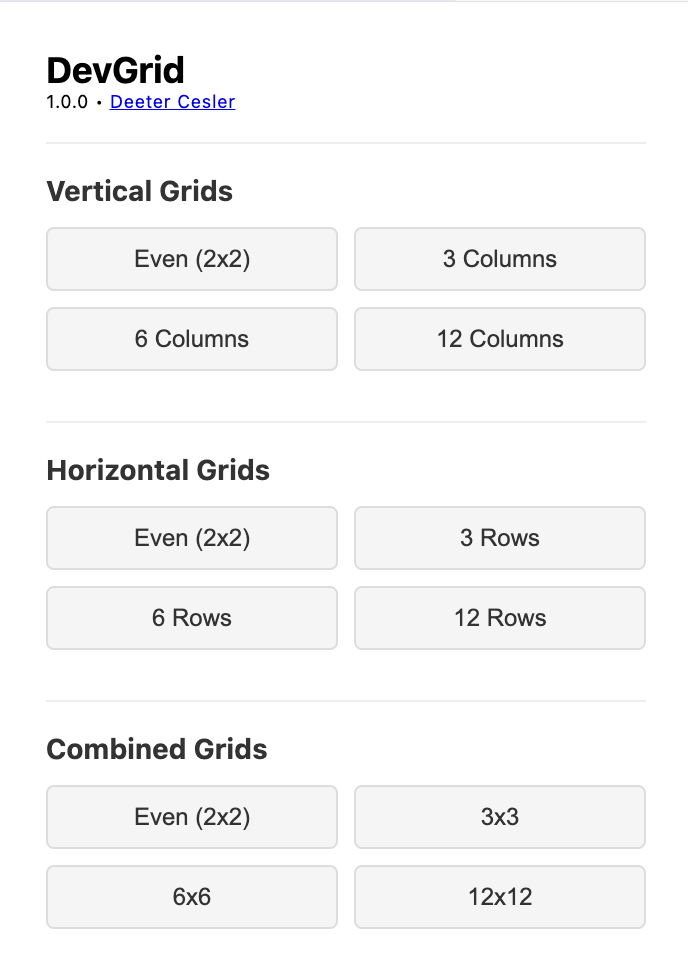
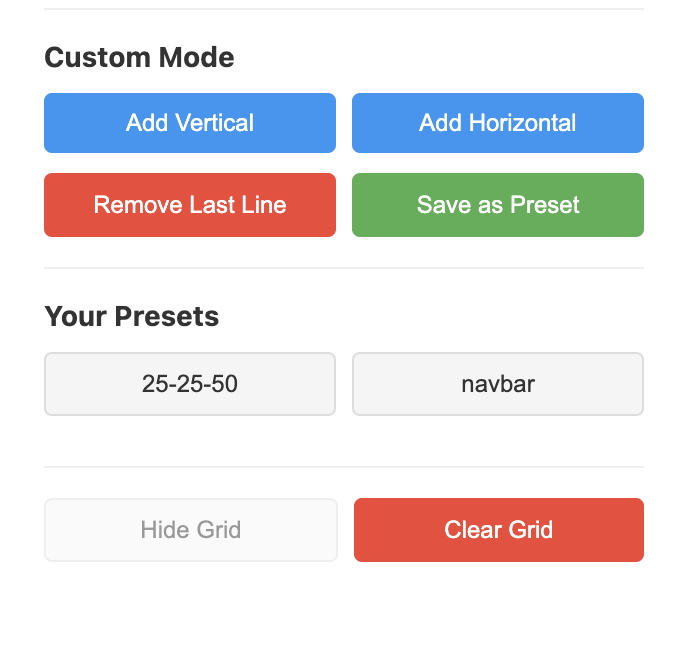
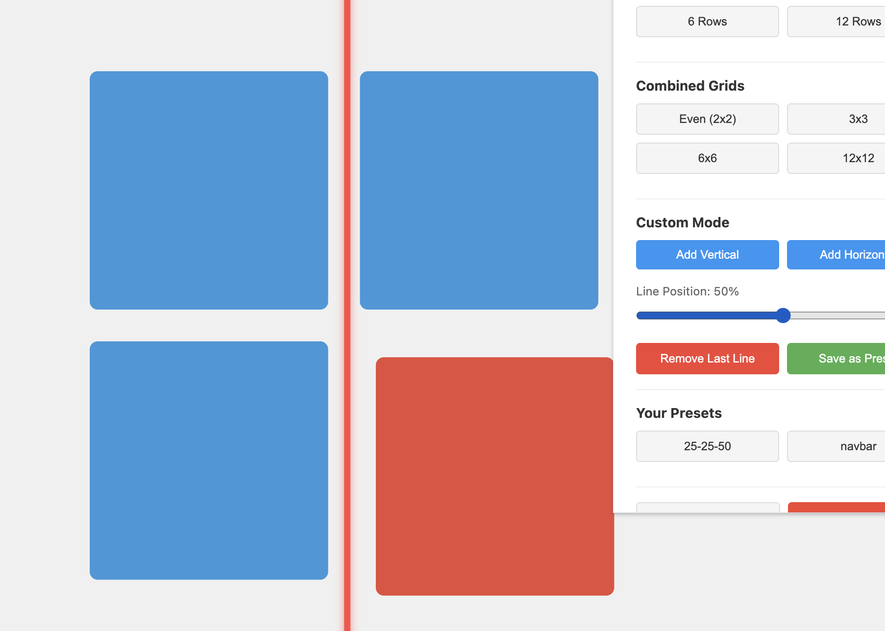
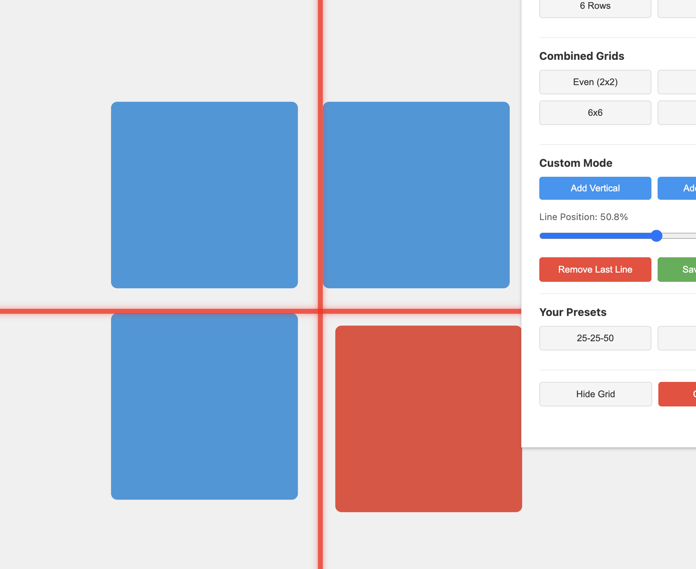

# Dev Grid

Dev Grid is a Chrome/Brave extension designed specifically for designers and frontend developers. This tool adds a customizable grid overlay to your browser, allowing you to easily check the alignment of elements on your web pages. With both vertical and horizontal lines, you can ensure that everything is lined up just the way you want it.

 

## Getting Started
To load _Dev Grid_ locally, follow these steps:
1. Clone the repository to your local machine.
2. Open Brave/Chrome and navigate to `brave://extensions` or `chrome://extensions`.
3. Enable "Developer mode" using the toggle in the top right corner.
4. Click on "Load unpacked" in the top left corner and select the folder where you cloned the repository.

## What It Is
- **Custom Lines**: Add vertical and horizontal lines to the grid and adjust along your elements.
- **Save Custom Grids**: Save your own grids for your common use cases.
- **Presets**: Comes with a few common presets (3x3, 6x6 etc. evenly spaced) to let you get started immediately.

## Example Use
1. **Unaligned Squares**: 
2. **Adding a Custom Line**: 
3. **Aligned Against Elements**: 

## Future Plans
If enough people ask for this, then I'll put it on the chrome store (for free). So just tweet at me @DeeterCesler or create an issue on Github if you want that.
